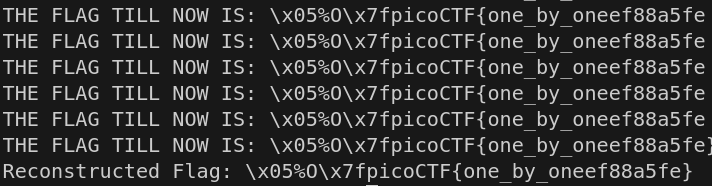
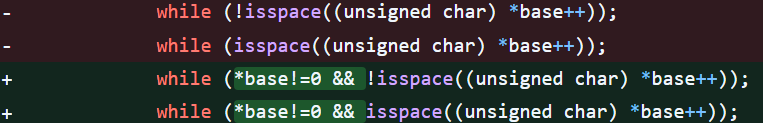

# CTF Challenge 1: One By One

The challenge focuses on demonstrating the OOB read vulnerability
and how can an attacker leverage such a flaw, to gain access to restricted 
information even if ther's only one byte of overflow.

***Challenge name:*** one-by-one

***Challenge type:*** Binary exploitation

***Points:***  100

## Overwiew

This challenge aims to throw light on the seriousness of the OOB read
vulnerability, with new CVEs like 
[CVE-2024-48208](https://www.cvedetails.com/cve/CVE-2024-48208/)
and [CVE-2023-23454](https://access.redhat.com/security/cve/cve-2023-23454), 
showing that even with one byte of OOB read the attacker can be succesful 
in either reading confidential data, or worse by leveraging the OOB read to 
change the control flow of the program itself.

The challenge provides the students with a service over netcat that prints
back the command they have entered and also some garbage bytes present in
another buffer. The students are also provided with the binary file of the
service , which can be further analyzed to understand the various functions,
and their working.

Now, after closer inspection the player will realize that there is an OOB
read of one byte present in the `super-service` function, and that the cmd
buffer when overflown, points to the `replybuf` which seems to be a very big 
buffer.

Now utilizing this OOB read vulnerability , the player can read at various
offsets of the `replybuf` which are printed back to them in the `GARBAGE`
section. The players can also potentially automate the solution of the 
challenge by creating a pwntools script similar to the `solver_nc.py` which
will incrementally keep on sending a larger payload till the flag has been 
extracted from the `replybuf`.

The challenge was developed after getting inspired from the OOB read
vulnerability in the recent 
[CVE](https://www.cvedetails.com/cve/CVE-2024-48208/)
in which the main lines of code for the vulnerability included the following:

## Files in this directory
1. [Dockerfile](./Dockerfile): This file follows the `cmgr` specification, 
and makes the CTF challenge cmgr compatible.
2. [problem.md](./problem.md): This file contains the challenge description,
name, points, as well as hints related to the challenge, and follows the
`cmgr` specification.
3. [setup-challenge.py](./setup-challenge.py): This is a python script
responsible for creating dynamic flags to ensure each player has a unique
flag during the submission.
4. [start.sh](./start.sh): A simple shell script to start the service and 
listen onto the specifiedTCP port for any input by the player.
5. [chal.c](./chal.c): The source code for the challenge.
6. [super_service](./super_service): The binary executable file for the 
challenge. 

## Compilation steps
To compile the source code to the binary use the following command:
`gcc -O0 -o super_service ./chal.c`

The binary we get consists of no compiler optimization , letting simple
reverse engineering and debugging tools like GDB, Ghidra, etc to 
reconstruct the source code, and let the player understand the vulnerability
present. 

## CMGR Deployment
To build with cmgr
1. Copy the folder to cmger challenges folder
2. Run `cmgr update`
3. Run the challenge in the CTF 