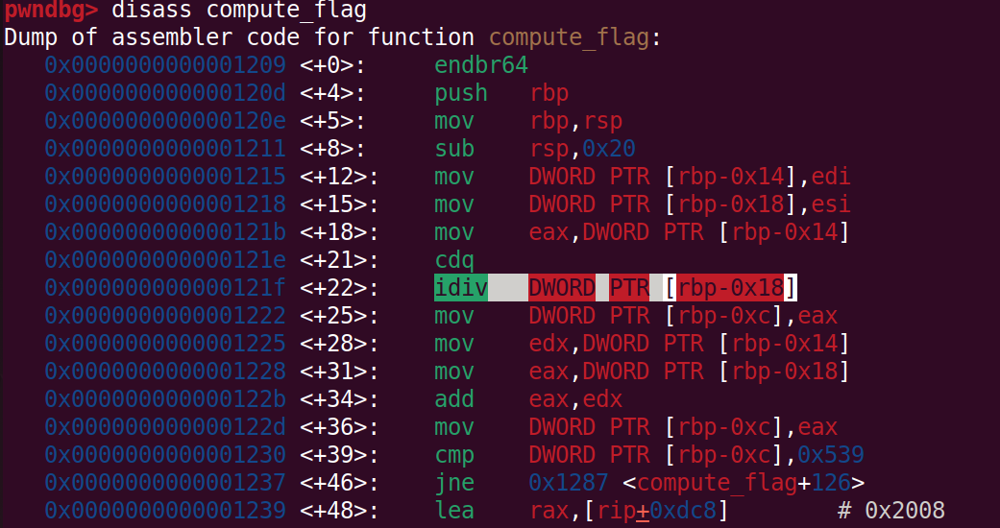
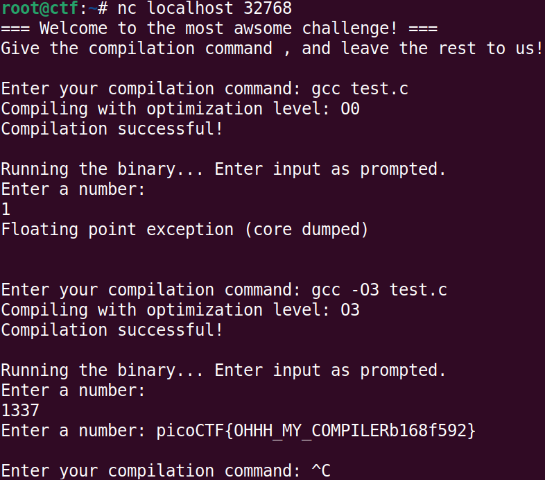

# CTF Challenge 2: welcome to my wOrld

The challenge focuses on demonstrating how compiler optimizations can lead
to logic flaws in the binaries , and how can those logic flaws
can lead to security vulnerabilities.

***Challenge name:*** get-fast

***Challenge type:*** Miscellaneous

***Points:***  150

## Overwiew

This challenge focuses on the serious issue of compiler optimizations leading
to unforseen logic changes in code , this has been a pressing issue , that
has caused multiple incidents like [Linux kernel bug](https://lwn.net/Articles/342330/)
and this [CERT Presentation](https://my.eng.utah.edu/~cs5785/slides-f10/Dangerous+Optimizations.pdf)
explains the issue further.

The challenge offers players with an unoptimized binary , which when they
reverse engineer , they will be able to spot the following trapdoor.

Now , when they connect to the nc service , the players can enter the 
compilation command , and let the rest be handled in the backend. 

If the player enters a compiler optimization flag of -O1,2,3 or fast , then
the compiler optimizes out the `idiv` instruction , and hence causes the 
binary to bypass the security trapdoor itself! The player can then easily
enter the secret value of `1337` to capture the falg.

## Files in this directory
1. [Dockerfile](./Dockerfile): This file follows the `cmgr` specification, 
and makes the CTF challenge cmgr compatible.
2. [problem.md](./problem.md): This file contains the challenge description,
name, points, as well as hints related to the challenge, and follows the
`cmgr` specification.
3. [setup-challenge.py](./setup-challenge.py): This is a python script
responsible for creating dynamic flags to ensure each player has a unique
flag during the submission.
4. [start.sh](./start.sh): A simple shell script to start the frontend 
service and listen onto the specifiedTCP port for any input by the player.
5. [chal.c](./chal.c): The source code for the challenge.
6. [super_secure](./super_secure): The binary executable file for the 
challenge. 

## Deployment steps
To deploy and play the challenge use the following command:
`cmgr update`

`cmgr playtest [challenge identifier]`